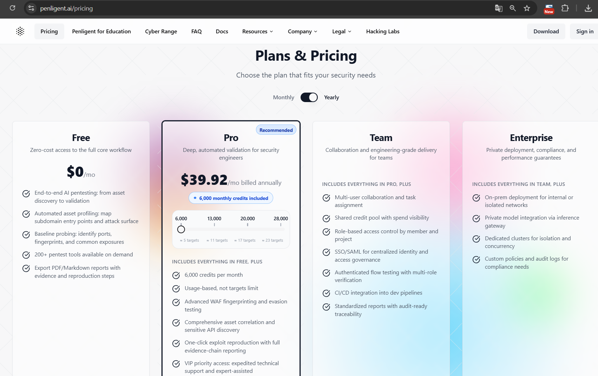

# Penligent - AI Penetration tester - homelab

#### Penligent to nowoczesne narzędzie do automatyzacji testów penetracyjnych (pentestów) zasilane przez sztuczną inteligencję (AI), takie **GUI + AI orchestration**.

#### Najważniejsze cechy:

**AI-powered pentest tool** – Penligent wykorzystuje dużych modeli językowych i inteligentnych agentów do prowadzenia analiz bezpieczeństwa, wykrywania luk, generowania exploitów oraz automatycznej adaptacji strategii testowania.

**Automatyzacja całego procesu** – od wykrywania zasobów, skanowania i weryfikacji CVE, po generowanie raportów zgodnych z normami (np. ISO 27001, PCI-DSS, NIST).&#x20;

**Integracja z narzędziami pentestowymi** – może uruchamiać klasyczne narzędzia Pentest (np. _nmap_, _hydra_, _Burp Suite_) w ramach swoich workflow.&#x20;

**Przyjazna dla użytkownika** – narzędzie oferuje UI, które redukuje konieczność ręcznego korzystania z CLI, dzięki czemu nawet użytkownik średnio zaawansowany może wykonywać kompleksowe testy.&#x20;

**Workflow i śledzenie dowodów** – Penligent pozwala na organizowanie testów jako projekty z dowodami i automatycznym raportowaniem.

Cennik:

<figure><figcaption></figcaption></figure>

#### Instalacja na Kali Linux:

1.  **Pobierz instalator**

    > Ze strony Penligent wymagana jest **rejestracja/invitation code** do pobrania paczki `.deb`.
    >
    > Plik instalacyjny: `penligent.kali_amd64_1.0.4.deb` lub nowszy (z oficjalnej strony z kodem pobierania — dostęp wymaga kodu dostępu / konta)

* **Przenieś plik na maszynę z Kali Linux**
* **Zaktualizuj system (opcjonalnie, ale zalecane)**
* ```bash
  sudo apt update && sudo apt upgrade -y
  ```
* **Zainstaluj pakiet `.deb`**&#x20;
* ```bash
  sudo dpkg -i penligent.kali_amd64_1.0.4.deb
  ```
* **Jeśli pojawią się błędy zależności:**
* ```bash
  sudo apt-get -f install
  ```
*   **Uruchom Penligent**

    Po instalacji w menu aplikacji lub:
* ```bash
  penligent
  ```
*   **Zaloguj się / skonfiguruj**

    Na pierwszym uruchomieniu zaloguj się przy użyciu swoich danych (dostęp z planem lub kontem).

### Przykłady typowych zadań Penligent:

### 1. Reconnaissance – skanowanie sieci i usług

#### Zadanie w Penligent

> „Zidentyfikuj hosty i usługi na celu”

#### Przykładowe komendy (uruchamiane automatycznie lub półautomatycznie):


```bash
nmap -sS -p- -T4 10.10.10.10
```

```bash
nmap -sV -sC -p 22,80,443 10.10.10.10
```

**Co Penligent z tym robi:**

* interpretuje wyniki
* zapisuje je jako „Asset Discovery”
* wiąże wersje usług z potencjalnymi CVE

### 2. Enumeracja HTTP / Web Recon

#### Zadanie w Penligent

> „Sprawdź, co działa na porcie 80/443”

#### Przykładowe komendy:

```bash
whatweb http://10.10.10.10
```

```bash
gobuster dir -u http://10.10.10.10 -w /usr/share/wordlists/dirb/common.txt
```

```bash
nikto -h http://10.10.10.10
```

**Rola Penligent:**

* wybiera narzędzie na podstawie technologii
* filtruje szum (false positives)
* zapisuje tylko istotne odkrycia

### 3. Skanowanie podatności (Vulnerability Scanning)

#### Zadanie w Penligent

> „Znajdź znane podatności dla wykrytych usług”

#### Przykładowe komendy:

```bash
nmap --script vuln -p 80,443 10.10.10.10
```

```bash
searchsploit apache 2.4.49
```

**Co robi AI Penligent:**

* łączy wersję usługi z CVE
* ocenia realność exploita
* sugeruje dalsze kroki (lub odradza)

### 4. Enumeracja usług (np. SSH, SMB)

#### Zadanie w Penligent

> „Sprawdź konfigurację i dostępność usług”

#### Przykładowe komendy:

```bash
enum4linux 10.10.10.10
```

```bash
smbclient -L //10.10.10.10 -N
```

```bash
ssh user@10.10.10.10
```

**Penligent:**

* interpretuje odpowiedzi
* zapisuje „weak configuration” jako finding
* nie brute-forcuje bez decyzji użytkownika

***

### 5. Testy uwierzytelniania (kontrolowane)

#### Zadanie w Penligent

> „Sprawdź odporność na słabe hasła (lab)”

#### Przykładowa komenda (edukacyjna):

```bash
hydra -l admin -P passwords.txt ssh://10.10.10.10
```

### 6. Testy aplikacji webowych (OWASP Top 10)

#### Zadanie w Penligent

> „Przetestuj logikę aplikacji i dane wejściowe”

#### Przykładowe narzędzia / komendy:

```bash
sqlmap -u "http://10.10.10.10/item.php?id=1" --batch
```

```bash
curl -X POST http://10.10.10.10/login \
-d "username=admin&password=test"
```

**Penligent:**

* tłumaczy _dlaczego_ dany wektor ma sens
* dokumentuje payload i odpowiedź
* zapisuje dowody do raportu

### 7. Post-exploitation (w labach)

#### Zadanie w Penligent

> „Sprawdź poziom dostępu po uzyskaniu wejścia”

#### Przykładowe komendy:

```bash
whoami
```

```bash
id
```

```bash
sudo -l
```

```bash
uname -a
```

**Penligent:**

* klasyfikuje poziom dostępu
* sugeruje potencjalne wektory eskalacji
* nie wykonuje ich automatycznie bez zgody

### 8. Raportowanie (automatyczne)

#### Zadanie w Penligent

> „Wygeneruj raport pentestu”

**Efekt (bez komendy):**

* opis podatności
* wpływ biznesowy
* rekomendacje
* dowody (logi, outputy, screenshoty)

### Jak to wszystko łączy Penligent?

Bez Penligent:

```
nmap → grep → notes.txt → nikto → copy/paste → raport
```

Z Penligent:

`Projekt → AI decyzje → narzędzia → dowody → raport`&#x20;

#### Środowisko testowe:

* **VM 1:** Kali Linux (attacker) + Penligent
* **VM 2:** DVWA (target)
* Sieć: **Host-only / Internal Network**
* DVWA Security Level: **Low** (edukacyjnie)

#### Konfiguracja DVWA

1. Zaloguj się do DVWA (`admin:password`)
2. `DVWA Security → Low`
3. `Setup → Create / Reset Database`&#x20;

##

## CEL PENTESTU (scope)

**Cel:**

> Zidentyfikować podatności aplikacji webowej DVWA i potwierdzić ich wpływ

**Zakres:**

* Recon
* Web vulnerabilities (SQLi, XSS)
* Brak DoS
* Brak brute-force poza modułami DVWA

## 1. RECONNAISSANCE (rozpoznanie)

### RĘCZNIE (Kali)

```bash
ip a
```

```bash
nmap -sn 192.168.56.0/24
```

* identyfikujemy IP DVWA, np. `192.168.56.101`

```bash
nmap -sS -sV -p 80 192.168.56.101
```

**Wynik:**

* Port 80 open
* Apache + PHP
* Aplikacja webowa

### PENLIGENT (AI decyzja)

**AI wnioskuje:**

* Aplikacja webowa → **OWASP Top 10 path**
* HTTP only → brak TLS → low maturity
* Proponuje: _Web Recon → Input validation tests_

**Różnica:**\
Ręcznie → musisz wiedzieć _co dalej_\
Penligent → sugeruje _kolejny logiczny krok_

## 2. WEB ENUMERATION

### RĘCZNIE

```bash
whatweb http://192.168.56.101
```

```bash
gobuster dir -u http://192.168.56.101 \
-w /usr/share/wordlists/dirb/common.txt
```

**Znajdujemy:**

* `/dvwa/`
* formularze
* parametry GET / POST

### PENLIGENT

* Automatycznie oznacza:
  * punkty wejścia (forms, params)
  * input vectors
* Klasyfikuje je jako **attack surface**

**Wniosek:**\
Penligent skraca etap „patrzenia się w aplikację”.

## 3. SQL INJECTION (DVWA → SQL Injection)

### RĘCZNIE (manual confirmation)

W formularzu:

```
1' OR '1'='1
```

\- Logika zapytania zostaje złamana

Potwierdzenie w CLI:

```bash
sqlmap -u "http://192.168.56.101/dvwa/vulnerabilities/sqli/?id=1&Submit=Submit" \
--cookie="PHPSESSID=xxx; security=low" --batch
```

**Wynik:**

* DB: MySQL
* Tabele: users
* Hasła (hash)

### PENLIGENT

**AI:**

* Rozpoznaje klasyczny SQLi pattern
* Odróżnia **error-based** od **boolean-based**
*   Oznacza podatność jako:

    > _High – Data Exposure_

**Różnica kluczowa:**\
Ręcznie → musisz znać payloady\
Penligent → tłumaczy _dlaczego to działa_

## 4. XSS (Reflected)

### RĘCZNIE

Payload:

```html
<script>alert(1)</script>
```

\- JS wykonuje się w przeglądarce

Test curl:

```bash
curl "http://192.168.56.101/dvwa/vulnerabilities/xss_r/?name=<script>alert(1)</script>"
```

### PENLIGENT

* Klasyfikuje jako **Reflected XSS**
* Tłumaczy wpływ:
  * session hijacking
  * phishing
* Sugeruje mitigację (output encoding)

## 5. AUTH / LOGIC TEST (DVWA → Brute Force)

### RĘCZNIE

```bash
hydra -l admin -P /usr/share/wordlists/rockyou.txt \
http-get-form \
"/dvwa/vulnerabilities/brute/:username=^USER^&password=^PASS^:Login failed"
```

\- hasło złamane (lab)

### PENLIGENT

**AI ostrzega:**

* high-risk activity
* wymaga potwierdzenia
* oznacza jako **auth weakness**

## 6. RAPORT & WNIOSKI

### Znalezione podatności

| Podatność     | Poziom |
| ------------- | ------ |
| SQL Injection | High   |
| Reflected XSS | Medium |
| Weak Auth     | High   |
| Brak HTTPS    | Low    |

### Rekomendacje (OWASP)

* Prepared Statements
* Output Encoding
* Rate limiting
* HTTPS
* Secure cookies

## CHECKLISTA PENTESTU (JUNIOR / EGZAMIN)

#### Recon

* Nmap (ports, services)
* Web fingerprinting

#### Web

* SQLi
* XSS
* Auth logic
* Input validation

#### Proof

* Payload
* Response
* Impact

#### Report

* Risk
* Fix
* Evidence

## ZALECENIA BEZPIECZEŃSTWA (RECOMMENDATIONS)

### 1. SQL Injection – **Wysokie ryzyko**

#### Opis problemu

Aplikacja nieprawidłowo obsługuje dane wejściowe użytkownika, co umożliwia manipulację zapytaniami SQL i dostęp do bazy danych.

#### Zalecenia techniczne

* Stosować **parametryzowane zapytania (Prepared Statements)** zamiast dynamicznego składania SQL
* Używać **ORM** lub bezpiecznych API bazodanowych
* Wdrożyć **walidację danych wejściowych** (whitelist)
* Ograniczyć uprawnienia konta DB (zasada **least privilege**)

#### _Źródła (sprawdzone):_

* _OWASP Top 10 – **A03: Injection**_
* _OWASP SQL Injection Prevention Cheat Sheet_
* _OWASP Testing Guide v4 – SQLi_

### 2. Cross-Site Scripting (XSS) – **Średnie ryzyko**

#### Opis problemu

Aplikacja nie filtruje ani nie koduje danych wyjściowych, co umożliwia wykonanie kodu JavaScript w przeglądarce użytkownika.

#### Zalecenia techniczne

* Stosować **output encoding** (HTML, JS, URL context-aware)
* Nie ufać danym pochodzącym od użytkownika
* Wdrożyć **Content Security Policy (CSP)**
* Unikać niebezpiecznych funkcji (np. `innerHTML`)

#### _Źródła:_

* _OWASP Top 10 – **A07: Cross-Site Scripting**_
* _OWASP XSS Prevention Cheat Sheet_
* _OWASP Secure Coding Practices_

### 3. Słabe mechanizmy uwierzytelniania – **Wysokie ryzyko**

#### Opis problemu

Brak ochrony przed próbami zgadywania haseł (brute-force) oraz słaba polityka haseł.

#### Zalecenia techniczne

* Wdrożyć **rate limiting / account lockout**
* Stosować **silną politykę haseł**
* Używać **hashowania haseł** (bcrypt, Argon2)
* Dodać **MFA** (jeśli możliwe)

#### _Źródła:_

* _OWASP Top 10 – **A02: Broken Authentication**_
* _OWASP Authentication Cheat Sheet_
* _NIST SP 800-63B (Digital Identity Guidelines)_

### 4. Brak szyfrowania komunikacji (HTTPS) – **Niskie ryzyko**

#### Opis problemu

Dane przesyłane są w postaci jawnej, co umożliwia ich przechwycenie (MITM).

#### Zalecenia techniczne

* Wymusić **HTTPS** (TLS 1.2+)
* Ustawić nagłówki bezpieczeństwa (`HSTS`)
* Używać certyfikatów zaufanych CA

#### _Źródła:_

* _OWASP Transport Layer Protection Cheat Sheet_
* _OWASP Top 10 – **A02: Cryptographic Failures**_
* _NIST SP 800-52 Rev. 2_

### 5. Walidacja danych wejściowych – **Ogólne zalecenie**

#### Opis problemu

Brak centralnej walidacji danych wejściowych zwiększa ryzyko wielu klas ataków.

#### Zalecenia techniczne

* Wdrożyć **centralny mechanizm walidacji**
* Stosować **whitelisting** zamiast blacklisting
* Oddzielić walidację od logiki biznesowej

#### _Źródła:_

* _OWASP Input Validation Cheat Sheet_
* _OWASP Secure Coding Guidelines_

### 6. Zarządzanie bezpieczeństwem aplikacji (organizacyjne)

#### Zalecenia procesowe

* Regularne **testy penetracyjne**
* Code review pod kątem bezpieczeństwa
* Szkolenia developerów z OWASP Top 10
* Automatyczne testy bezpieczeństwa (SAST / DAST)

#### _Źródła:_

* _OWASP SAMM_
* _OWASP ASVS_
* _NIST Secure Software Development Framework (SSDF)_

