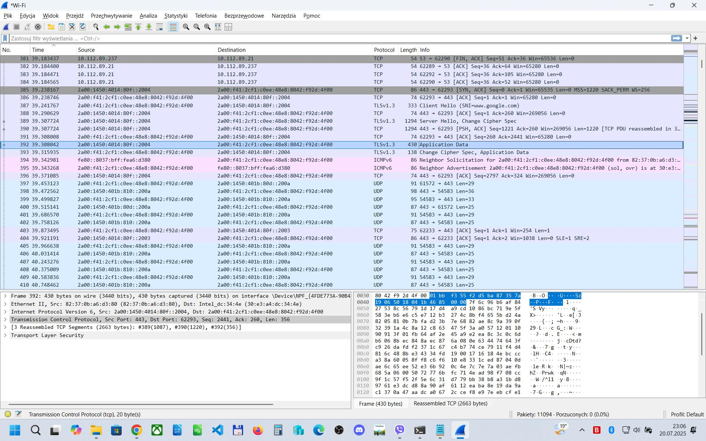
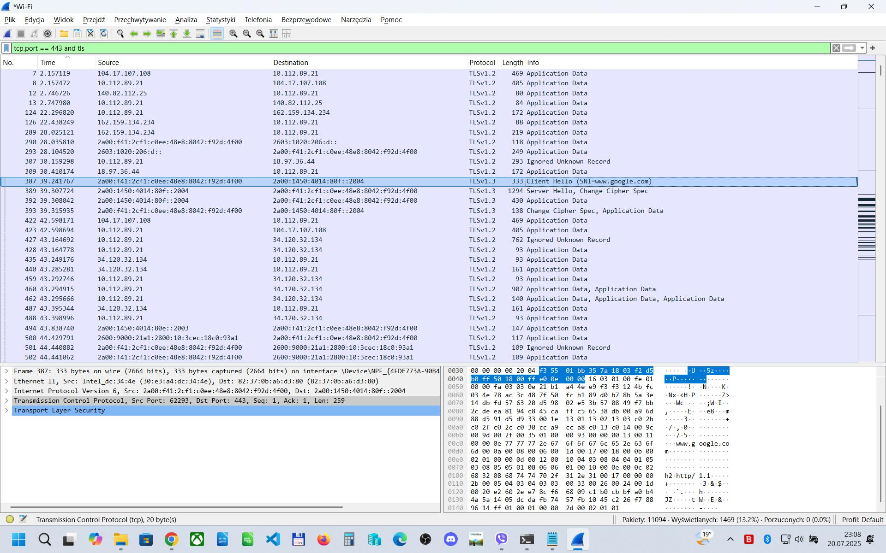
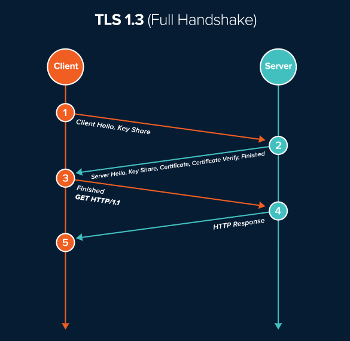

# LAB: Wireshark TLS handshake

<figure><figcaption></figcaption></figure>

Filtering:

<figure><figcaption></figcaption></figure>

| Protocol    | Description                                                | Notes / Packet Example                      |
| ----------- | ---------------------------------------------------------- | ------------------------------------------- |
| **TCP**     | Transmission Control Protocol                              | Reliable, connection-based communication    |
| **UDP**     | User Datagram Protocol                                     | Lightweight, connectionless communication   |
| **HTTP**    | HyperText Transfer Protocol                                | Web traffic, GET/POST requests              |
| **DNS**     | Domain Name System                                         | Resolving domain names to IP addresses      |
| **TLSv1.2** | Transport Layer Security v1.2                              | Encrypted HTTPS traffic                     |
| **QUIC**    | UDP-based protocol for faster web traffic (used by Google) | Observed in modern browser traffic          |
| **mDNS**    | Multicast DNS                                              | Local name resolution without a central DNS |
| **SSDP**    | Simple Service Discovery Protocol                          | Used in UPnP for device discovery           |
| **ARP**     | Address Resolution Protocol                                | Resolves MAC addresses from IP addresses    |
| **DHCPv6**  | Dynamic Host Configuration Protocol for IPv6               | Assigns IPv6 addresses dynamically          |
| **TLSv1.3** | Transport Layer Security v1.3 (newer)                      | **More secure, shorter handshake**          |

<figure><figcaption></figcaption></figure>
